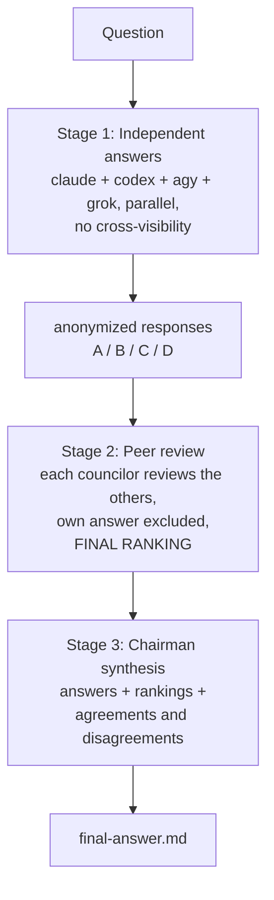

# Council

[](https://github.com/epicsagas/mcp-council/stargazers)
[](https://github.com/epicsagas/mcp-council/issues)
[](https://github.com/epicsagas/mcp-council/commits/main)
[](LICENSE)
[](https://buymeacoffee.com/epicsaga)

**Multi-model council: independent answers, anonymized peer review, chairman synthesis.**

A single skill file that runs on any agent host with a shell. Four model families (claude, codex, agy/Gemini, grok) answer the same question independently, review each other anonymously with self-exclusion, and a chairman synthesizes the final answer. Inspired by [karpathy/llm-council](https://github.com/karpathy/llm-council).

This project started as a Rust MCP server plus Cursor chat commands. Modern agents made that plumbing redundant: agents read and write files natively, dispatch each other as headless CLI processes, and need no MCP layer in between. The whole system is now one skill file. The original Rust implementation is preserved at the `rust-legacy` and `v0.2.0` tags.

## The pattern



Why it works:

| | Property | Why it matters |
|--|---------|----------------|
| 🧭 | Independence | Stage 1 councilors never see each other's answers, so answers are genuinely independent |
| 🎭 | Anonymization | Reviewers see only `Response A/B/C/D`, so rankings judge content, not brand |
| 🚫 | Self-exclusion | A councilor never reviews its own answer, removing self-serving bias |
| ⚖️ | Chairman synthesis | One final answer weighs insights, rankings, and disagreement patterns instead of picking a winner |

## Install

Claude Code:

```bash
claude plugin marketplace add epicsagas/mcp-council
claude plugin install council
```

Codex:

```bash
codex plugin marketplace add epicsagas/mcp-council
codex plugin add council
```

Antigravity (agy):

```bash
agy plugin install https://github.com/epicsagas/mcp-council
```

Grok:

```bash
grok plugin install epicsagas/mcp-council --trust
```

Any other host: copy `skills/council/` into the host's skills directory.

Requirements: the councilor CLIs on PATH (`claude`, `codex`, `agy`, `grok`). Each councilor drops out independently when its CLI is missing or quota-limited. No MCP server is required.

## Usage

```
/council Should we split the auth service out of the monolith?
/council Compare WAL vs journal-mode tradeoffs for our write-heavy workload
```

The skill runs all three stages and replies with the chairman's verdict plus the artifact paths.

## Artifacts

Each run writes to `.council/<slug>/` in the current project (gitignored):

```
.council/<slug>/
  claude-answer.md
  codex-answer.md
  agy-answer.md
  grok-answer.md
  peer-review-by-claude.md
  peer-review-by-codex.md
  peer-review-by-agy.md
  peer-review-by-grok.md
  final-answer.md
  run-log.md            # failures and degraded-mode notes
```

## Degradation

Failed backends (missing CLI, quota or auth error, empty reply) are dropped and logged. Two survivors still run the full flow. One survivor skips peer review; the chairman critically reviews the single answer before synthesizing. Zero survivors aborts with the backend errors.

## Contributing

See [CONTRIBUTING.md](CONTRIBUTING.md). PRs welcome.

## License

Apache 2.0. See [LICENSE](LICENSE).
